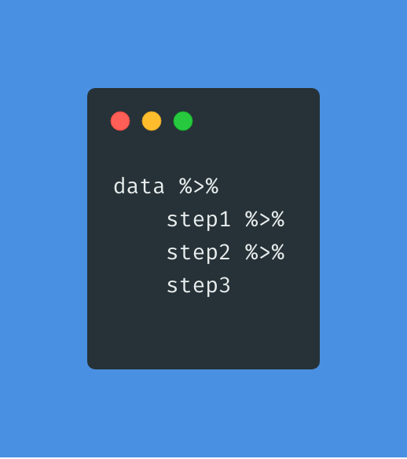

```{r include = FALSE}
#options(htmltools.dir.version = FALSE)
#xaringan::inf_mr()
```


```{r setup, include=FALSE}
knitr::opts_chunk$set(eval = F, 
                      warning = F,
                      message = F)

library(tidyverse)
library(skimr)
library(janitor)
library(here)
library(kableExtra)
library(xaringan)


```

class: center, middle, inverse, dk-section-title

**Slides adapted from David Keyes (@dgkeyes), inspired by Danielle Navarro (@djnavarro) and Paul Campbell (@paulcampbell91)**

---


```{r include = F, eval = T}
data <- read_csv(here("data/chds6162_data.csv")) %>% 
  clean_names()
```


## Child Health and Development Studies (CHDS)

.pull-left[
*"Birth weight, date, and gestational period collected as part of the Child Health and Development Studies in 1961 and 1962. Information about the baby's parents — age, education, height, weight, and whether the mother smoked is also recorded."*
]

.pull-right[

]

???

Website: https://www.stat.berkeley.edu/users/statlabs/papers/sample.pdf
R package: https://vincentarelbundock.github.io/Rdatasets/doc/mosaicData/Gestation.html


---

class: inverse, center, middle, dk-section-title

# Tidyverse

---


---

## Base R Syntax


--

```{r}
table(data$age,
      data$ed)
```

--

- In this example, table is our function and our data frame goes in the parentheses

--

- The dollar sign is used to specify the column or variable we want (data_frame$variable)

--

> Con: you have to refer to the database every time (annoying)

--

> Pro: there are thousands of add-on packages available for R at CRAN

---


## Tidyverse Syntax


```{r}
data %>% 
  tabyl(age, ed)

```

--

- This is the same as earlier but did you notice I only referred to my dataframe once?
--

- The pipes! (%>%). They chain together a series of functions

---

class: center, middle

## The Pipe

.pull-left[]
.pull-right[]

---

### The Pipe

I would read each pipe as "then." For example:

```{r}
data %>% 
  filter(age < 25) %>% 
  group_by(ed) %>% 
  summarize(mean_gestation = mean(gestation, na.rm = TRUE))

```

---
Art by @allison_horst

---
## Shortcuts

.pull-left[


**Windows**  

*control-shift-M*]

--
.pull-right[


**Mac**

*command-shift-M* ]
---

1. These are the functions we will go over:

  <ol start=1>
  .pull-left[
  <li> rename
  <li> clean_names
  <li> toupper/tolower
  <li> separate/unite
  <li> select  
  <li> filter
  ]
 
  <ol start=7>
  .pull-right[
  <li> mutate
  <li> case_when
  <li> summarize
  <li> group_by
  <li> relocate
  <li> pivot_longer/pivot_wider
]


